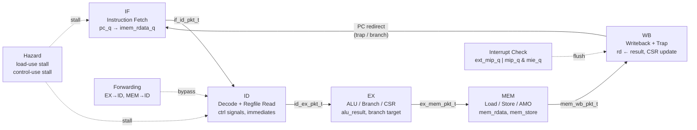
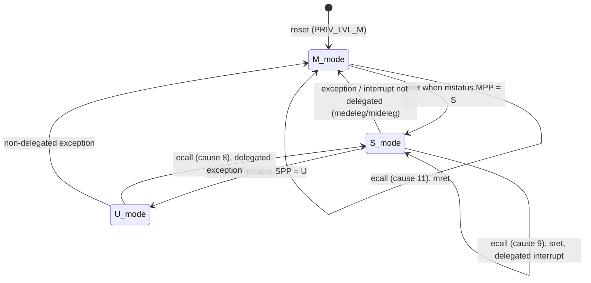
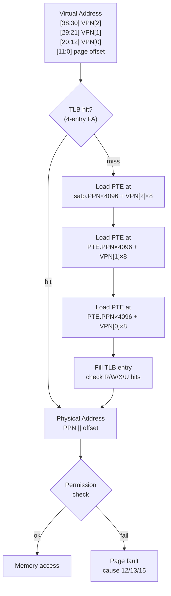
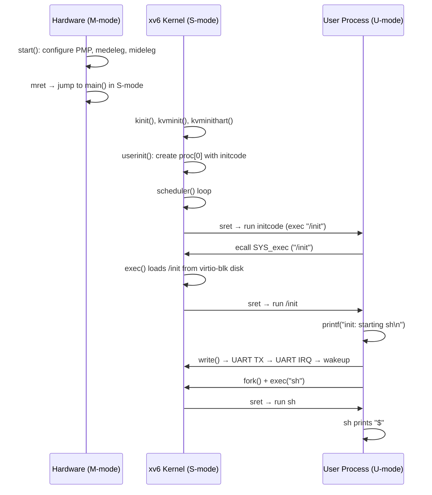

# RISCy-Experiment

A hand-built RV64 processor implemented in **Anvil HDL**, compiled via SystemVerilog to a Verilator simulation, capable of booting **xv6-riscv** to a shell prompt.

```
xv6 kernel is booting

init: starting sh
$
```

The design prioritises architectural correctness over microarchitectural optimisation — every instruction retires precisely, every trap is delivered to the right privilege level, and the virtual-memory page table walk is faithful to the RISC-V privileged specification.

---

## Pipeline Architecture



### Stage Responsibilities

| Stage | Key operations |
|-------|---------------|
| **IF** | Drive `pc_q` to instruction memory; latch `imem_rdata_q` pre-populated by the harness |
| **ID** | Decode opcode into `ctrl_sig_t`; read two register operands; detect and resolve hazards |
| **EX** | Integer ALU, branch condition, JALR address, CSR read value forwarded to WB |
| **MEM** | Load/store byte-lane alignment; AMO read-modify-write; page-fault detection; store commit |
| **WB** | Write result to `regs_q[]`; dispatch exceptions to CSR state; redirect PC on trap/mret/sret |

---

## Privilege and Trap Flow



**Delegation rule:** if `medeleg[cause]` (exceptions) or `mideleg[cause]` (interrupts) is set and the current privilege is ≤ S, the trap is taken to S-mode using `stvec/sepc/scause`. Otherwise it always goes to M-mode.

**Interrupt priority:** MTI (bit 7) > MSI (bit 3) > STIP (bit 5) > SSIP (bit 1) > SEIP (bit 9) > MEIP (bit 11).  
Interrupts fire at WB before any instruction retires, so they are taken precisely at the current instruction boundary.

---

## Virtual Memory — Sv39

When `satp[63:60] == 4'h8` and the privilege level is ≤ S, all instruction fetches and data accesses use Sv39 three-level page table translation.



**Implementation note:** The page table walker lives entirely in the C++ simulation harness (`sim/sim_main.cpp`), not in the Anvil RTL. This avoids the ~14 GB peak RSS that the Anvil OCaml elaborator hits when compiling wide comparator trees. The harness writes pre-translated physical addresses into `sv39_if_pa_q` / `sv39_mem_pa_q` before each clock edge; the RTL just reads those registers.

---

## xv6 Boot Sequence



---

## Repository Layout

```
RISCy-Experiment/
├── src/
│   ├── types/               # Shared HDL type definitions (.anvilh headers)
│   │   ├── pipeline.anvilh  # Packet structs for each pipeline stage boundary
│   │   ├── riscv.anvilh     # CSR addresses, privilege levels, mstatus layout
│   │   ├── capstone.anvilh  # Capability type (future Capstone extension)
│   │   └── channels.anvilh  # Channel type aliases
│   └── core/
│       ├── top/             # Top-level pipeline proc (the entry point for Anvil)
│       │   ├── pipeline_core.anvil   # 5-stage pipeline, trap/interrupt dispatch
│       │   └── packet_utils.anvil    # Bubble/NOP constructors, zero_cap helper
│       ├── decode/          # Instruction decode helpers
│       │   ├── ctrl.anvil   # Opcode → control signal table
│       │   ├── fields.anvil # Instruction field extraction (rs1/rs2/rd/funct3…)
│       │   └── immgen.anvil # Immediate sign-extension for all encoding formats
│       ├── execute/         # Execution units
│       │   ├── alu.anvil    # RV64I integer ALU + W-ops + MUL; DIV/REM uses pipeline RTL divider
│       │   ├── branch.anvil # Branch condition evaluation
│       │   └── cap_alu.anvil# Capstone capability ALU (future extension)
│       ├── csr/
│       │   └── csr_state.anvil  # M/S-mode CSR state, trap/return helper functions
│       ├── hazard/
│       │   ├── hazard.anvil     # Stall signal generation (load-use, control-use)
│       │   └── forward.anvil    # EX→ID and MEM→ID bypass multiplexers
│       ├── fetch/
│       │   └── imem.anvil       # Instruction memory read (thin wrapper)
│       ├── memory/
│       │   └── mem_stage.anvil  # MEM stage: load sign-extension, store commit
│       └── writeback/
│           └── wb.anvil         # Writeback value selector (load vs ALU result)
├── sim/
│   ├── sim_main.cpp   # Verilator harness: ELF loader, MMIO shims, Sv39 PTW, PLIC
│   ├── startup.S      # Minimal CRT for freestanding C++ program tests
│   └── link.ld        # Linker script: program entry at 0x80000000
├── fpga/
│   ├── constraints/genesys2.xdc # Genesys 2 board constraints
│   ├── scripts/                 # Vivado check/synthesis scripts
│   └── src/risky_genesys2_top.sv # Genesys 2 synthesis smoke wrapper
├── scripts/
│   ├── build.sh              # Anvil → SystemVerilog → Verilator → binary
│   ├── build_program_sim.sh  # Rebuild the ELF-loading simulator
│   ├── export_fpga_rtl.sh    # Bounded Anvil RTL export for FPGA flows
│   ├── run_riscv_tests.sh    # Run all ISA regression tests
│   ├── run_program_tests.sh  # Run all freestanding C++ program tests
│   ├── verify_all.sh         # No-hang build + regression entry point
│   ├── lint_generated_sv.sh  # Verilator lint for generated SystemVerilog
│   ├── run_xv6_smoke.sh      # Boot xv6 with timeout and prompt check
│   ├── run_program.sh        # Run a single C++ program test
│   ├── run_program_trace.sh  # Run with pipeline trace output
│   └── compile_program.sh    # Compile a .cpp file to RISC-V ELF
└── tests/
    ├── isa/             # RISC-V ISA assembly tests (privilege, Sv39, Capstone)
    │   ├── env/         # RISC-V test environment header (riscv_test.h)
    │   └── macros/      # Test assertion macros (test_macros.h)
    └── programs/        # Small freestanding C++ smoke tests
```

---

## Building and Running

### Prerequisites

- [Anvil HDL compiler](https://github.com/project-starch/Anvil-Experimental)
- `verilator` ≥ 4.2
- `clang++` with `lld` (or `riscv64-unknown-elf-g++`)
- `opam` switch at `/home/omar/anvil-exp-5.2` (or set `ANVIL_BIN`)

### Quick start

```bash
# Full build: Anvil → Verilator → binary
scripts/build_program_sim.sh

# Run ISA regression
scripts/run_riscv_tests.sh

# Run guarded build + ISA + C++ regressions
scripts/verify_all.sh

# Include xv6 smoke when kernel/fs image paths are available
RUN_XV6=1 XV6_KERNEL=/path/to/xv6-riscv/kernel/kernel \
    XV6_FS_IMG=/path/to/xv6-riscv/fs.img scripts/verify_all.sh

# Export RTL and run Genesys 2 FPGA synthesis smoke when Vivado is available
scripts/export_fpga_rtl.sh
cd fpga && make synth

# Boot xv6 (requires xv6-riscv built with NCPU=1, PHYSTOP=0x80800000)
build/pipeline_core/obj_dir/Vpipeline_core \
    /path/to/xv6-riscv/kernel/kernel 30000000 \
    --disk /path/to/xv6-riscv/fs.img
```

### Build a single Anvil module

```bash
scripts/build.sh src/core/top/pipeline_core.anvil pipeline_core
```

**Note:** Anvil builds are memory-intensive. The build script now runs Anvil
with a bounded virtual-memory limit and host timeout by default:

```bash
ANVIL_VMEM_MB=12288 ANVIL_TIMEOUT=20m scripts/build.sh ...
```

Set `ANVIL_VMEM_MB=0` only if you intentionally want to disable the memory
guard.

---

## Toolchain Details

| Tool | Version used | Notes |
|------|-------------|-------|
| Anvil | experimental | Custom HDL; `.anvil` → `.sv` |
| Verilator | ≥ 4.2 | `-O0 -disable-lt-checks` flags for pipeline_core |
| clang++ | system | Test ELF compilation target `riscv64-unknown-elf` |
| riscv64-unknown-elf-gcc | xv6 build | Kernel compilation |

---

## Implementation Status

The current target is robust Verilator bring-up. Several features are
simulation-backed and must be replaced with RTL before FPGA synthesis; see
`FPGA_READINESS.md`.

| Feature | Status |
|---------|--------|
| RV64I base ISA | ✅ Covered by regression tests |
| RV64M multiply/divide | ✅ Complete in RTL |
| M-mode traps (ecall, ebreak, exceptions) | ✅ Complete |
| S-mode (stvec, sepc, scause, sret) | ✅ Complete |
| Sv39 virtual memory | ✅ Verilator-tested; PTW/TLB simulation-backed |
| Timer interrupt (MTIP, STIP) | ✅ RTL timer pending path; CLINT MMIO shim Verilator-backed |
| xv6-riscv boot to shell | ✅ Verilator target; FPGA path needs RTL devices/storage |
| RV64A atomics (AMO) | ✅ Complete |
| FPGA synthesis | 🔲 Genesys 2 synthesis-smoke flow scaffolded |
| Capstone capability extension | 🔲 Scaffolding only |

---

## Roadmap

1. ✅ RV64I + M-mode traps
2. ✅ S-mode + Sv39 paging
3. ✅ Boot xv6-riscv
4. 🔲 FPGA hardening (Genesys 2 Vivado flow, real BRAM, UART/PLIC/virtio RTL or bus adapters, timing closure)
5. 🔲 Capstone: capability domains, transitions, revocation
